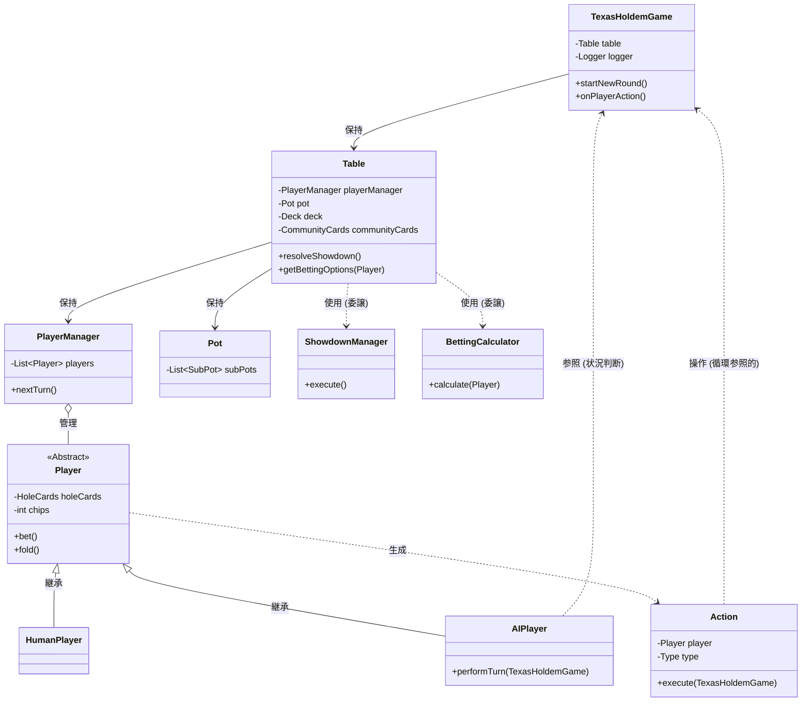

```mermaid
classDiagram
    %% メインコントローラー
    class TexasHoldemGame {
        -Table table
        -Logger logger
        +startNewRound()
        +onPlayerAction()
    }

    %% 状態管理
    class Table {
        -PlayerManager playerManager
        -Pot pot
        -Deck deck
        -CommunityCards communityCards
        +resolveShowdown()
        +getBettingOptions(Player)
    }

    class PlayerManager {
        -List~Player~ players
        +nextTurn()
    }

    class Pot {
        -List~SubPot~ subPots
    }

    %% プレイヤー
    class Player {
        <<Abstract>>
        -HoleCards holeCards
        -int chips
        +bet()
        +fold()
    }
    class HumanPlayer
    class AIPlayer {
        +performTurn(TexasHoldemGame)
    }

    %% アクションとロジック
    class Action {
        -Player player
        -Type type
        +execute(TexasHoldemGame)
    }

    class ShowdownManager {
        +execute()
    }

    class BettingCalculator {
        +calculate(Player)
    }

    %% 関係性
    TexasHoldemGame --> Table : 保持
    
    Table --> PlayerManager : 保持
    Table --> Pot : 保持
    
    PlayerManager o-- Player : 管理
    
    Player <|-- HumanPlayer : 継承
    Player <|-- AIPlayer : 継承
    
    Player ..> Action : 生成
    Action ..> TexasHoldemGame : 操作 (循環参照的)
    AIPlayer ..> TexasHoldemGame : 参照 (状況判断)

    Table ..> ShowdownManager : 使用 (委譲)
    Table ..> BettingCalculator : 使用 (委譲)

```
