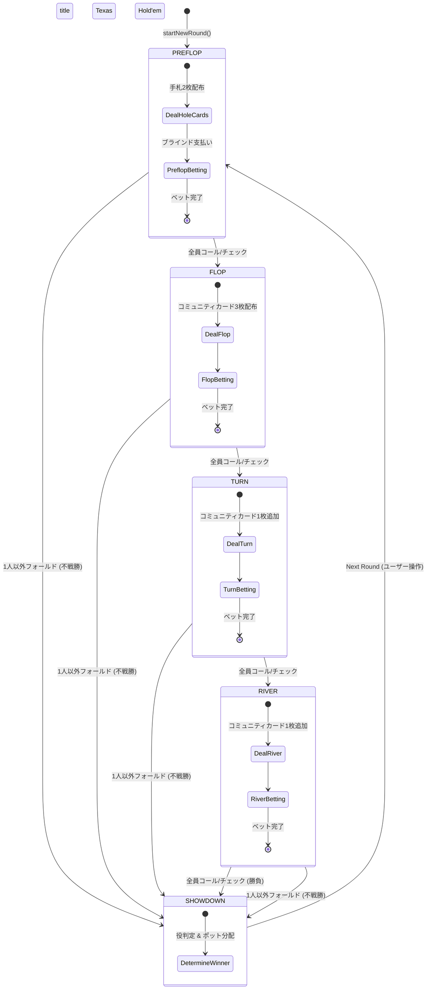

```mermaid
stateDiagram-v2
    title Texas Hold'em State Machine

    %% 初期状態からゲーム開始
    [*] --> PREFLOP : startNewRound()

    %% --- PREFLOP ---
    state "PREFLOP" as PREFLOP {
        [*] --> DealHoleCards : 手札2枚配布
        DealHoleCards --> PreflopBetting : ブラインド支払い
        PreflopBetting --> [*] : ベット完了
    }

    PREFLOP --> FLOP : 全員コール/チェック
    PREFLOP --> SHOWDOWN : 1人以外フォールド (不戦勝)

    %% --- FLOP ---
    state "FLOP" as FLOP {
        [*] --> DealFlop : コミュニティカード3枚配布
        DealFlop --> FlopBetting
        FlopBetting --> [*] : ベット完了
    }

    FLOP --> TURN : 全員コール/チェック
    FLOP --> SHOWDOWN : 1人以外フォールド (不戦勝)

    %% --- TURN ---
    state "TURN" as TURN {
        [*] --> DealTurn : コミュニティカード1枚追加
        DealTurn --> TurnBetting
        TurnBetting --> [*] : ベット完了
    }

    TURN --> RIVER : 全員コール/チェック
    TURN --> SHOWDOWN : 1人以外フォールド (不戦勝)

    %% --- RIVER ---
    state "RIVER" as RIVER {
        [*] --> DealRiver : コミュニティカード1枚追加
        DealRiver --> RiverBetting
        RiverBetting --> [*] : ベット完了
    }

    RIVER --> SHOWDOWN : 全員コール/チェック (勝負)
    RIVER --> SHOWDOWN : 1人以外フォールド (不戦勝)

    %% --- SHOWDOWN ---
    state SHOWDOWN {
        [*] --> DetermineWinner : 役判定 & ポット分配
    }

    SHOWDOWN --> PREFLOP : Next Round (ユーザー操作)
```
